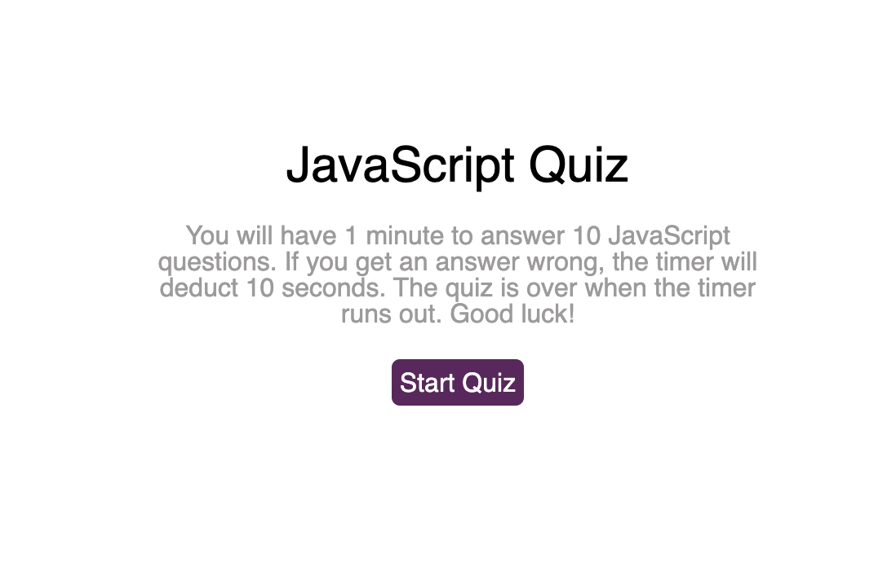
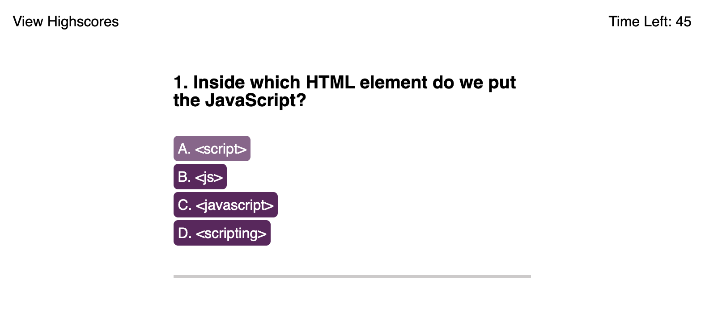
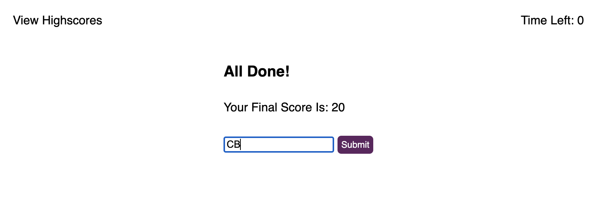
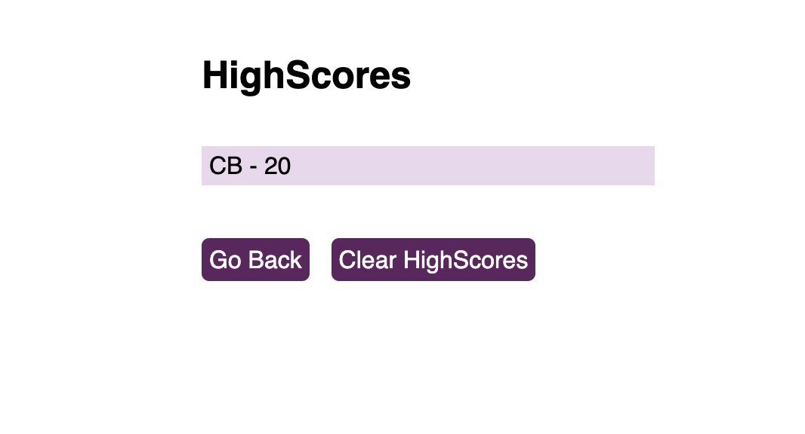

# codeQuiz

### _A JavaScript Quiz Game that provides feedback with each answered question, tallies user score and stores in localStorage for later comparison. This application is responsive and not built with starter code._

## Table of Contents

- [Media](#Media)

- [Features](#Features)

- [Contributors](#Contributors)

- [Contact](#Contact)

- [Project Status](#project-status)

- [License](#License)

## Media

## Features

Built with HTML, CSS and JavaScript.

## Contributors

This application was created by Celeste Moore.

## Contact

If you have any questions about this repository, contact celestealexmoore via GitHub or reach out via email:
celestealexmoore@gmail.com.

## Project Status

Completed

---

## License

© 2023 _celestealexmoore_